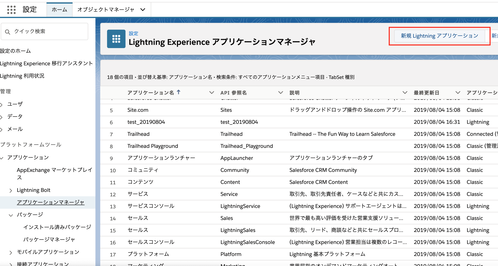

## SFDC

<details open>
<summary>ACCOUNT</summary>

```


組織: doumichi (00D2v000001fArW)
ユーザ: rong yang (0052v00000aMZhs)
パッケージ: DreamHouse (04tB00000009UeX)

組織: 株式会社同道Japan (00D2v000001fDJ4)
ユーザ: rong y (0052v00000a5BTv)
パッケージ: DreamHouse (04tB00000009UeX)
```
</details>


----
[salesforce 資格一覧](http://tandc.salesforce.com/credentials)


##### お勧め設定：
①[設定]-[プロファイル]-[システム管理者]
  ログイン IP アドレスの制限で「0.0.0.0～255.255.255.255」を設定

②[設定]-[パスワードポリシー]
  [パスワードの有効期間]を<無期限>に設定
  [過去のパスワードの利用制限回数]を<制限なし>に設定
  [ログイン失敗によりロックするまでの回数]を<制限なし>に設定

③[設定]-[ログインアクセスポリシー]
  [管理者は任意のユーザでログインできます]の有効化をONにする

④[設定]-[セッションの設定]
  [ユーザとしてログインしてから再ログインを強制する]をOFFにする
  [延長期間中に Lightning Experience で IE11 を使用することに同意する]をONにする
  [パフォーマンスを向上させるためにブラウザの安全で永続的なキャッシュを有効にする]をOFFにする  
  ****注册一个开发者账户，不可以重复用户ID

-------
### SFDC OBJECT
标准object

##### 基本的に存在ある項目
スシテム項目|説明
---|:--:
ID|KEYとして使われていることがだめ、データ移行してID変わる可能。
IsDeleted|レコードのコミ箱に移動するか
CreatedById|作成者ID
CreatedDate|作成日
lastModifiedById|改修ID
lastModifiedDate|改修日
SystemModstamp|
Owner|指定られる所有者

##### レポート及びダッシュボード
<details open>
<summary>標準レポート</summary>

- order by一回しかない、
- 複数order by使われるときに、EXCELエクスポートして、絞りできること。
- レポート参照するときに、「条件」はSQLのWHERE相当する。
- レポート参照するときに、「バケット項目」にIF文logic書ける。子SQL文ASと相当する。
</details>

##### App Exchange

- APP Store

##### ドメイリセット

- Lighting

##### 権限概要

- オブジェクト権限(権限セット/プロファイル)
  - ユーザーはオブジェクトインスタンス参照、作成、編集、削除のできる
  - 表示/非表示
- 項目権限(権限セット/プロファイル)
 - 参照
 - 編集
 - 項目ないの値で検索権限なし
- レコード権限
  - ユーザーに一部オブジェクトレコードのアクセス権限を付与し、
  - 全てのレコードはユーザーまたはキューが所有します、所有者はレコードにフルアクセスでき。
  - 組織の共有設定>>>>ロール階層(共有設定)>>>>共有ルルー(共有設定)>>>>共有の直接設定(Lightningそいう機能なし)>>>>APEX 管理共有

      


権限セット/プロファイル
- 権限セット(从无到有)

---
#### Console
- `select * `无法使用，是因为云开发，此查询太消耗资源。
- salesforce作为云开发,apex开发也无法在线debug
- 查询log，可以filte logic等级
- log等级根据作业系统，有不同的lev，不同的lev，又有不同的行为检测
- 【设定】>>[debug log]也可以输出log


#### アプマネージャ
- アプリケーション新規
  - [設定]>>[アプマネージャ]>>[新規 Lightning アプリケーション]
  - 要件指定されている機能を組み合わせ
  
- アプリ編集
  - [設定]>>[アプマネージャ]>>[対象アプリ]>>[編集]
  - [ユーザプロファイル]:ユーザによて参照権限設定


#### オブジェクト作成
- [設定]>>[オブジュエクトマネージャ]>>[作成]
- よく使ってる機能なので、下記の項目チェックした方がいい  
  

- [項目とリレーション]で項目定義と編集
- 一般的に、使ってる項目タイプがある
- 特に、[選択リスト値セット]にグロバル選択リスト作成できる、重複作業を防ぐ。
- [連動チェック]と[連動選択リスト]を使用することで、ユーザは正確で整合性の取れたデータを入力できます。

#### レコードタイプ
- 業務種類によって、画面表示スタイル統一できるように
- [ページレイアウト]で連動

#### ページレイアウト
- classic時代で単一「レイアウト」編集機能

#### タブ
[タブと表示ラベルの名称変更]で標準オブジェクトの[表示ラベル]を編集できる(API名編集できない)  
[タブ]個人でタブ[子画面]作成、タイトルとタブスタイル(基本的な仕様)だけ。画面中の内容編集が[lightingページレイアウト]で編集可能。
- カスタムオブジェクトタブ
  - カスタムオブジェクトのレコードに保存されたデータを表示するためのタブを定義します。
- Web タブ
  - Web タブを作成することにより、ユーザが Web アプリケーションを使用したり、アプリケーションから別の Web サイトを使用したりできます。
- Visualforce タブ
  - Visualforce ページは、Visualforce で作成されたカスタムアプリケーションの最上位コンテナです。Visualforce ページを作成するには、Visualforce コンポーネント (標準またはカスタム)、静的 HTML マークアップ、CSS スタイルと JavaScript をページに追加します
- Lightning コンポーネントタブ
  - 標準コンポーネントとは、Salesforce が作成した Lightning コンポーネントです。Lightning ページを作成するときに、いくつかの標準コンポーネントを使用できます。
- Lightning ページ タブ
  - Salesforce アプリケーションナビゲーションリストまたは Lightning アプリケーションに Lightning ページのアプリケーションページ種別を追加するには、事前に Lightning ページのカスタムタブを作成する必要があります。
---

#### 主従関係
- 親レコード削除すると、子レコードも消えた。
- 主従関係作成
  - 子オブジェクトから「主従関係」作成
- 関連リスト
  - 親オブジェクトで作成
- Custom主従SOQLで参照方法
  - `select id,name,(select id from Ref_B__r) from A__c`
- 標準主従SOQLで参照方法
  - `select id,name,(select id from contact) from account`

#### 積み上げ
- しか主従関係の主オブジェクトで作成できない。

#### 参照関係
- 親レコード削除するか、子レコードに構わず。

#### ページレイアウト(詳細)
- classicでページレイアウトだけ

#### Lightningページレイアウト
- [Lightning アプリケーションビルダー]>>[新規]
- [レコードページ]<=>[レコードタイプ]関連して、[レコードタイプ]によって、各自特有のレイアウトページ作成。
- [レコードタイプ]作成すると、[レイアウトの割り当て]で弄らないと行けない。

#### 項目セット
- Visualforceソースは項目によって、動的に指定している項目を取得できて、最終にページで表示されるよう。

#### Tips
- 将ID直接贴在主页url的`.com/`后边，可以直接查询此条数据  
`https://salesforce.force.com/a012v00002BxsCWAAZ`

- [画面のURLとURLパラメータ](http://blog.flect.co.jp/salesforce/2011/07/urlurl-9d6c.html)
- [salesforce数式](https://help.salesforce.com/articleView?id=customize_functions.htm&type=5)


---
## APEX開発

- [APEX開発ガイド](https://developer.salesforce.com/docs/atlas.ja-jp.apexcode.meta/apexcode/apex_dev_guide.htm)

#### about Database class

Operation|Result Class
---|:--
insert, update	|SaveResult Class
upsert	|UpsertResult Class
merge	|MergeResult Class
delete	|DeleteResult Class
undelete	|UndeleteResult Class
convertLead	|LeadConvertResult Class
emptyRecycleBin	|EmptyRecycleBinResult Class

#### DML 操作で同時に使用できない sObject
[同じトランザクション内で DML 操作を実行する場合、次の sObject は他の sObject と一緒に使用できません。](https://developer.salesforce.com/docs/atlas.ja-jp.apexcode.meta/apexcode/apex_dml_non_mix_sobjects.htm)

[SOQL SELECT の構文](https://developer.salesforce.com/docs/atlas.ja-jp.soql_sosl.meta/soql_sosl/sforce_api_calls_soql_select.htm)

##### SOQL日付参照
###### last_n_days:2を例とした場合  

###### next_n_days:2を例とした場合


[SOQLやビューでよく使う日付の検索条件文字列](http://crmprogrammer38.hatenablog.com/entry/2017/08/28/120000)

##### 親子関係としてはSOQL参照方法
1. **childObj=>parentObj**
```
select Id,parentObj_r.<property> from childObj
※標準オブジェクトなら
select Id,Account.<property> from childObj
```

1. **childObj=>parentObj=>parentObj1(parentObj参照parentObj1)**
```
select Id,parentObj_r.parentObj1_r<property> from childObj
```
1. **parentObj=>childObj**
```
select Id,(select Id,<property> from 子リレション名__r) from parentObjt
※標準オブジェクトなら
select Id,(select Id,<property> from 子リレション名) from parentObjt
```

#### SOQL構文
1. heapの通常サイズが6MBなので、念の為。大量データ取得については気付け。
1. paramとして、ラムダ変数を使わないように。
1. Data.query()のに、ラムダ変数を使えない。

### SOSL(salesforce objet search language)


- [テキスト検索の例](https://developer.salesforce.com/docs/atlas.ja-jp.soql_sosl.meta/soql_sosl/sforce_api_calls_sosl_examples.htm)

##### FIND {SearchQuery}
- SOSL クエリは、必須の FIND 句で始まります。次に任意の句を追加して、オブジェクト種別、項目、データカテゴリなどによってクエリを絞り込むことができます。返される内容を決定することもできます。たとえば、結果の順序を指定したり、返す行の数を指定したりできます。
- 必須の FIND 句の後には、1 つ以上の任意の句を次の順序で追加できます。
```
FIND {SearchQuery}
[ IN SearchGroup ]
[ RETURNING FieldSpec [[ toLabel(fields)] [convertCurrency(Amount)] [FORMAT()]] ]
[ WITH DivisionFilter ]
[ WITH DATA CATEGORY DataCategorySpec ]
[ WITH SNIPPET[(target_length=n)] ]
[ WITH NETWORK NetworkIdSpec ]
[ WITH PricebookId ]
[ WITH METADATA ]
[ LIMIT n ]
...  
[ UPDATE [TRACKING], [VIEWSTAT] ]
```


##### ❗️RETURNING ObjectTypeName❗️
- 指定されていない場合のデフォルトの動作では、高度な検索で検索可能なすべてのオブジェクトおよびカスタムオブジェクト (カスタムタブがない場合も含む) の ID を返します。返される最大数は、LIMIT n 句で指定された最大数または 2,000 (API バージョン 28.0 以降) のうち小さい方になります
```
RETURNING ObjectTypeName
[(FieldList [WHERE conditionExpression] [USING Listview=listview name] [ORDER BY Clause] [LIMIT n] [OFFSET n])]
[, ObjectTypeName [(FieldList [WHERE conditionExpression] [ORDER BY Clause] [LIMIT n] [OFFSET n])]]
```
- [RETURNING FieldSpec](https://developer.salesforce.com/docs/atlas.ja-jp.soql_sosl.meta/soql_sosl/sforce_api_calls_sosl_returning.htm)
